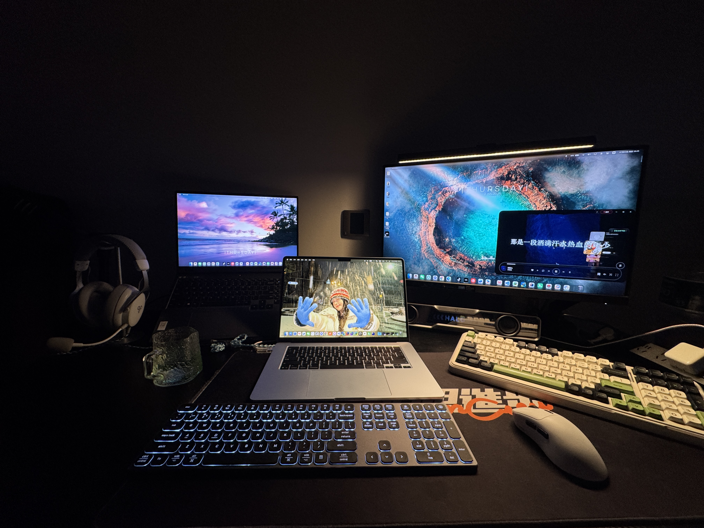
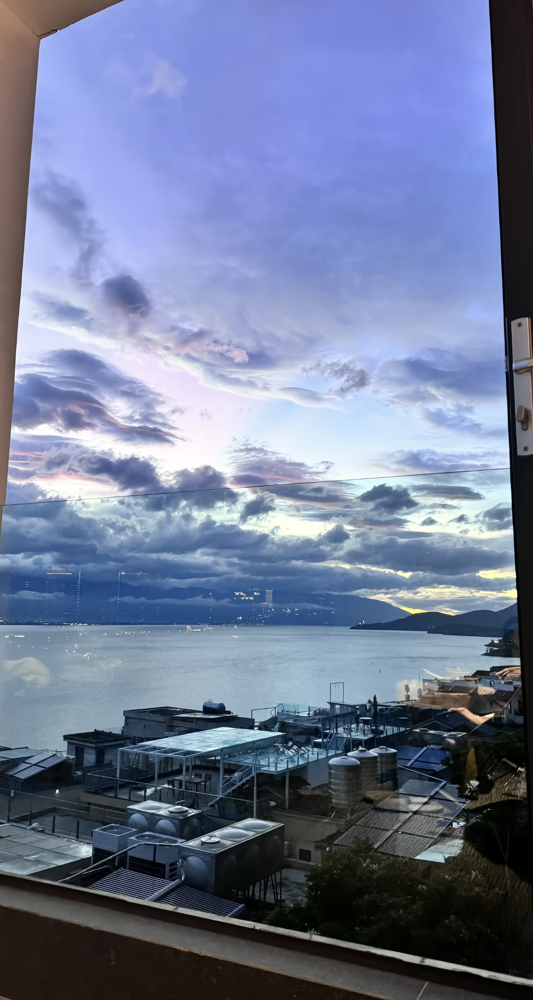

title: 重新启程
tags: [随笔、碎碎念、沉淀]
readTime: 3
time: 2026/08/30

# 重新启程

> 2026/08/30 Sunday \
> "上善若水 水利万物而不争"

### 叶的缝隙

七八月的阳光试图照进我的小窝，那透过窗帘缝隙透射进来的一缕缕光线，就这样悄无声息地从生活的缝隙里溜走了。唉，也权当是给自己放了个暑假吧。秋天都快到了，总不能一直如此颓废。

八月的最后几天，窗外的蝉鸣已经不那么聒噪了。声音变得稀薄，像被什么东西一点点抽走，留下空旷的尾巴。我坐在电竞桌前，屏幕是黑的，映出自己的倒影——一个头发有些乱、眼神有些散的人。房间里很安静，只有空调低频的嗡鸣。这种安静，在小窝的第一个月里让我恐慌，在第二个月里让我习惯，在这个月里，忽然让我感到一种奇异的空旷。

时间过得很慢。不是忙碌的那种慢，而是一种停滞感——每天醒来的第一件事是看手机，最后一件事也是看手机。中间夹着大段空白，不知道该做什么，或者说，做了很多事，但回过头来看，一件都没有真正记住。收藏夹里的教程还是那些教程，文档里的笔记还是那些笔记，它们安静地躺在那里，和我保持着一种心照不宣的距离。我知道它们在那里，它们也知道我在看它们，但我们谁也没有真正开始。

### 水的形状

壬水，是大江大河，是容乃百川的汪洋大海。

我学八字的时候第一次接触到这个概念。壬水是阳水，是流动的水，是不停歇的水。它不像癸水那样温柔内敛，壬水是奔涌的、开阔的、有气势的。它遇到山就绕，遇到谷就填，遇到堤坝就冲，但它从不因此停止。

"水利万物而不争"——这句话被写过太多次，几乎被用烂了。但当我真正试着去理解它的时候，才发现它说的不是消极的退让，而是一种更深邃的智慧。水不是不争夺，而是它不争那些虚名浮利。它知道自己要去哪里，所以不需要用咆哮来证明自己的存在。它只是流，只是流，在流的过程中塑造峡谷、滋润平原、最终汇入海洋。

可我呢？我是一个壬水命的人，却把自己困在了一个杯子里。小窝不大，但足够困住一个以为世界只有方寸的人。过去两个月，我没有主动去找任何事做。

### 秋天的第一个念头

秋天快到了。南京的秋天很短暂，短到像是一个错觉。但就在那短暂的缝隙里，空气会变得格外清澈，阳光会变得格外温和，整个人会突然从夏天的黏腻中挣脱出来，换一种呼吸的节奏。

重新启程，不是要做一个惊天动地的决定，也不是要马上解决所有问题。而是从今天开始，每天做一件让水流更快的事情——哪怕只是打开那个吃灰已久的教程，哪怕只是写下一行代码，哪怕只是把窗帘拉开，让光进来。

壬水不怕曲折。曲折不是阻碍，是壬水的本质。没有曲折，就没有江；没有江，就没有海。

### 尾声

窗外的呼啸的车声又响起来了，比上午密集了一些。我打开电脑，屏幕亮起，那个吃灰的教程文件夹静静地躺在桌面角落。我点开它，看到一个还没看完的文档，光标在最后一行闪烁着，像是在等什么。

我等这一刻很久了。

手指放在键盘上，停顿了一秒，然后开始落下。

---

> 流水不争先，争的是滔滔不绝。
> ——《道德经》意译

